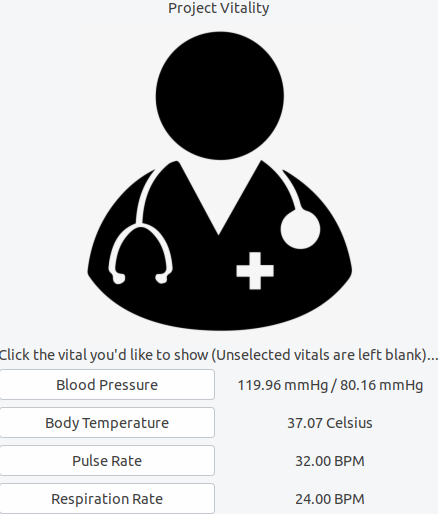
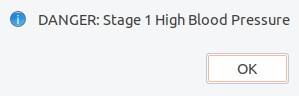

# Vital-Monitor

In this project, C++ is used to simulate the function of vital monitor. The code should be used with RaspberryPi.

Please visit https://drive.google.com/file/d/1zt-uhHyTRTj1s2-oAWPoV9-67XPyEJb4/view?usp=sharing if you are interested.

This program currently only supports Linux system, to run this program.

1. Begin by downloading the Gtk GUI kit by using the following command in Unix (Yes to all)...
    sudo apt-get install libgtk2.0-dev

2. To run...
    make -> Compiles files and executable called 'main;
    
    make test -> Runs the executable
    
    make clean -> Deletes all files generated from 
    compilation if they exist
    
    NOTE: No .o files are created independently, the linker/loader work together in one command line.

## Example Images

Vital Monitor Screen

Warning when Abnormal Vital Sign is Detected